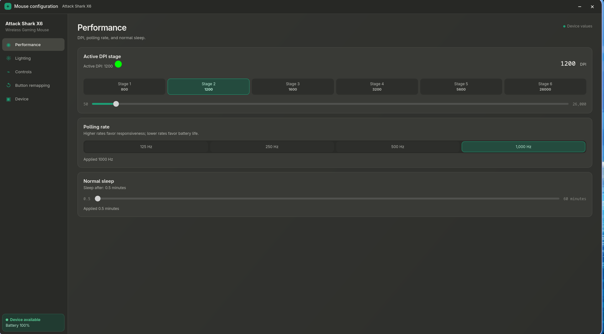
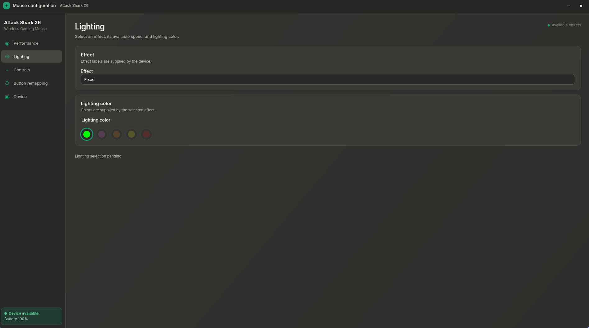
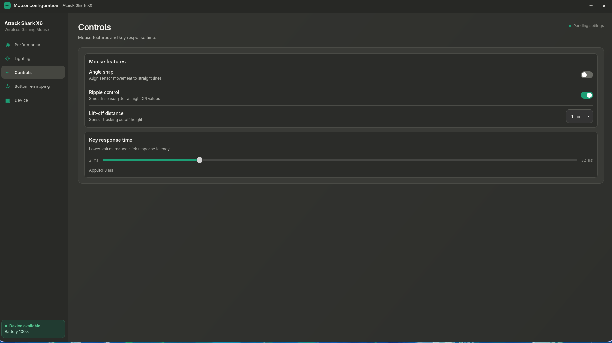
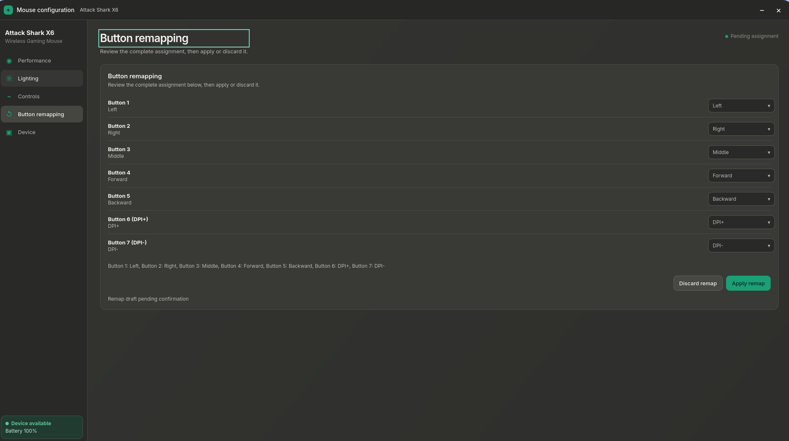
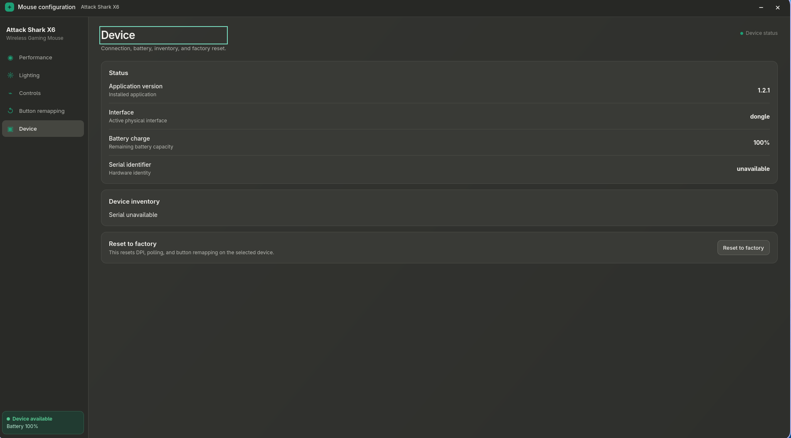

# Attack Shark X6 Linux Configurator — User Guide

This guide provides a comprehensive walkthrough of the **Attack Shark Linux** desktop configurator for the Attack Shark X6 wireless gaming mouse (`VID:PID 1d57:fa60`). The application is built with Go + [Wails v3](https://wails.io) and React + Vite, communicating directly with the hardware through Linux `/dev/hidraw` devices without background root daemons, kernel driver modifications, or proprietary Windows services.

---

## Table of Contents

- [Overview & Workspace Layout](#overview--workspace-layout)
- [Performance View](#performance-view)
- [Lighting View](#lighting-view)
- [Controls View](#controls-view)
- [Button Remapping View](#button-remapping-view)
- [Device & Maintenance View](#device--maintenance-view)
- [Emergency Recovery](#emergency-recovery)

---

## Overview & Workspace Layout

The user interface follows GNOME HIG design principles with an uncluttered dark theme, instant visual feedback, and keyboard-friendly navigation.

### Global Workspace Elements

- **Navigation Rail (Left Sidebar)**: Switch between the five core configuration panels:
  - **◉ Performance**: DPI stages, polling rate, and normal sleep timeout.
  - **☼ Lighting**: RGB effect modes, speed variants, and color presets.
  - **⌁ Controls**: Sensor enhancements (Angle snap, Ripple control, Lift-off distance) and key response debounce.
  - **↺ Button remapping**: 7-button customization with staging and draft confirmation.
  - **▣ Device**: Hardware status, live battery monitoring, device inventory, and factory reset.
- **Top Bar**: Displays the active mouse profile name (**Attack Shark X6**), an optional device selector dropdown when multiple eligible receivers are plugged in, and real-time firmware synchronization and persistence status badges (`Firmware applied`, `Persistence saved`).
- **Connection & Battery Card (Bottom Left)**: Live indicator showing device availability (`Device available` / `Device unavailable`) and current battery level percentage (`Battery 100%`). Hardware battery heartbeats and physical DPI button presses are pushed live from the mouse dongle to the UI.
- **Auto-Sync vs. Draft Confirmation**:
  - Sliders and toggles in **Performance**, **Lighting**, and **Controls** are debounced and automatically applied to the hardware after one second of user inactivity.
  - **Button Remapping** uses an explicit draft workflow requiring confirmation before sending new bindings to the hardware, preventing accidental lockouts.

---

## Performance View

The **Performance** view manages sensor resolution, USB reporting frequency, and energy-saving sleep timers.



### 1. Active DPI Stage & Stage Tuning

- **Active DPI Stage Selector**: Displays the active DPI stage (Stages 1 through 6) with individual DPI values and color indicators. Clicking any stage immediately activates it on the mouse. Pressing the physical DPI buttons on the mouse also updates the active stage in real time.
- **Granular DPI Slider**: Adjusts the resolution of the currently selected stage from **50 DPI** to **26,000 DPI** in precise **50-DPI increments**.
- **Factory DPI Stages**:
  - Stage 1: 800 DPI
  - Stage 2: 1,200 DPI
  - Stage 3: 1,600 DPI
  - Stage 4: 3,200 DPI
  - Stage 5: 5,600 DPI
  - Stage 6: 26,000 DPI

### 2. Polling Rate

Controls how frequently the mouse reports position updates to the host computer:

- **Selectable Rates**: `125 Hz` (8 ms), `250 Hz` (4 ms), `500 Hz` (2 ms), and `1,000 Hz` (1 ms).
- **Default**: `1,000 Hz` for maximum responsiveness and tracking accuracy in competitive gaming.
- **Battery Impact**: Lower rates (e.g., 250 Hz or 500 Hz) reduce CPU wakeups and conserve wireless battery life during productivity or travel use.
- **Status Indicator**: Confirms when the selected frequency has been acknowledged by hardware (`Applied 1000 Hz`) and persisted to the local per-device profile.

### 3. Normal Sleep

Configures how long the mouse remains active during idle periods before entering low-power sleep mode:

- **Adjustment Range**: **0.5 minutes (30 seconds)** to **60 minutes**, adjusted via slider in 0.5-minute increments.
- **Wake Behavior**: The mouse wakes immediately upon motion or click input.
- **Default**: `0.5 minutes` (30 seconds) for optimal wireless power efficiency.

---

## Lighting View

The **Lighting** view configures the RGB LED lighting strip and illuminated logo on the Attack Shark X6.



### 1. Effect Selection

- **Hardware Effect Modes**: Choose from firmware-supported lighting patterns such as `Fixed` (steady color), breathing, dynamic wave/streaming, and off. Effect names and capabilities are queried directly from the device firmware.

### 2. Speed Variants & Color Templates

- **Animation Speed Slider**: For animated lighting effects, adjust the animation speed step-by-step.
- **Color Presets**: Select from device-supported color swatches (e.g., Neon Green, Magenta, Orange, Yellow) or effect-controlled multi-color modes.
- **Live Status**: Displays the current synchronization state (`Lighting selection pending` while staging, `Lighting applied` upon hardware acknowledgement).

---

## Controls View

The **Controls** view provides fine-grained control over sensor tracking characteristics and switch debounce timings.



### 1. Mouse Features (Sensor Enhancements)

- **Angle Snap** (Switch):
  - *Align sensor movement to straight lines.*
  - When enabled, the sensor firmware suppresses slight angular deviations, snapping horizontal and vertical sweeps to straight axes.
  - Useful for CAD drafting, drawing, or horizontal tracking drills; recommended **OFF** for standard FPS gameplay.
- **Ripple Control** (Switch):
  - *Smooth sensor jitter at high DPI values.*
  - Applies a smoothing filter to eliminate high-frequency sensor noise and erratic cursor jitter at very high resolutions (typically above 5,000 DPI).
  - Keeps cursor tracking clean without introducing perceptible input lag at normal DPI ranges.
- **Lift-Off Distance (LOD)** (Dropdown):
  - *Sensor tracking cutoff height.*
  - **1 mm** (Default): Low cutoff height. Stops tracking almost immediately when the mouse is slightly raised, eliminating cursor drift during aggressive pick-up-and-swipe mouse resets.
  - **2 mm**: Higher tracking cutoff. Suitable for uneven or textured mouse pads that require a wider optical focal range.

### 2. Key Response Time (Debounce)

- **Adjustable Debounce Slider**: Configures the microswitch debouncing window from **2 ms** to **32 ms** in 2 ms steps.
- **Default**: `8 ms`.
- **Tradeoffs**:
  - *Lower values (2–4 ms)*: Minimize click registration latency for maximum reaction speed in competitive gaming.
  - *Higher values (8–16 ms)*: Provide greater electrical switch debounce margin, preventing accidental double-clicking on aging switches.
- **Status & Retry**: Displays applied debounce delay (`Applied 8 ms`) with a retry button if local persistence needs re-synchronization.

---

## Button Remapping View

The **Button remapping** view configures the physical buttons of the mouse. To prevent accidental loss of mouse control, button remapping uses a **draft and confirmation workflow**.



### 1. Remappable Physical Buttons

All 7 physical mouse controls can be assigned custom actions:

1. **Button 1**: Left Click (*restricted to Basic actions to guarantee mouse usability*)
2. **Button 2**: Right Click
3. **Button 3**: Middle Click (Scroll wheel click)
4. **Button 4**: Forward (Front thumb button)
5. **Button 5**: Backward (Rear thumb button)
6. **Button 6**: DPI+ (Top button behind the scroll wheel)
7. **Button 7**: DPI− (Lower top button behind DPI+)

### 2. Available Action Library

Each button can be assigned to actions grouped into three distinct categories:

| Category | Actions |
|---|---|
| **Basic** | Left, Right, Middle, Forward, Backward, Double Click, Fire, Off |
| **Multimedia** | Media Player, Play/Pause, Stop, Previous Track, Next Track, Volume Up, Volume Down, Mute |
| **Mouse Controls** | Scroll Up, Scroll Down, DPI Cycle, DPI+, DPI− |

### 3. Draft Confirmation Workflow

Unlike performance sliders that auto-apply after a delay, button remapping uses an explicit confirmation model:

1. **Drafting**: Select new actions for any button using the dropdown menus. The summary text updates live to reflect the staged assignment.
2. **Reviewing**: A draft status indicator (`Remap draft pending confirmation`) signals that changes have not yet been sent to the mouse.
3. **Applying**: Click **Apply remap** (or press `Enter`) to compile and write the 56-byte report over hidraw. The status updates to `Button remapping applied`.
4. **Discarding**: Click **Discard remap** (or press `Escape`) to cancel unapplied changes and restore the currently active configuration.

---

## Device & Maintenance View

The **Device** view provides hardware diagnostics, multi-device management, and reset operations.



### 1. Status Information

- **Application version**: Installed version of the configurator (e.g., `1.2.1`).
- **Interface**: Active physical interface through which the mouse is communicating (`dongle` for 2.4 GHz wireless receiver or `wired` for USB connection).
- **Battery charge**: Real-time remaining battery capacity percentage (`100%`).
- **Serial identifier**: Hardware serial identifier reported by the dongle or `unavailable` for serialless dongles.

### 2. Device Inventory

Displays all detected Attack Shark devices connected to the host system. When multiple receivers or mice are attached, the configurator lists each device path, interface type, and eligibility status, allowing seamless profile switching.

### 3. In-App Factory Reset

If custom settings cause unintended behavior, you can restore factory defaults directly from the UI:

1. Click **Reset to factory** in the Reset card.
2. An inline confirmation dialog appears:
   > *This resets DPI, polling, and button remapping on the selected device.*
3. Click **Confirm factory reset** to write factory defaults across all lanes and clear stale local profiles, or **Cancel factory reset** to abort.

---

## Emergency Recovery

If an applied button remapping disables left-click or renders the mouse unnavigable in graphical environments, you do not need the GUI to recover. Attack Shark Linux includes a headless, command-line recovery tool.

### Running the Headless Reset

Execute the reset command from your terminal:

```sh
attack-shark-linux reset
```

If using the user-local AppImage:

```sh
cd ~/.local/share/attack-shark-x6
./attack-shark-linux-x86_64.AppImage reset
```

### What Emergency Reset Does

1. **No Window**: Executes completely headlessly without loading the Wails application or React frontend.
2. **Hardware Target Discovery**: Discovers and validates the connected Attack Shark X6 hidraw node using `/dev/hidraw*`.
3. **Synchronous Factory Write**: Directly writes the documented factory configuration:
   - DPI: Default 6-stage curve (800, 1200, 1600, 3200, 5600, 26000)
   - Polling rate: 1,000 Hz
   - Normal sleep: 0.5 minutes (30 seconds)
   - Sensor features: Angle snap OFF, Ripple control OFF, LOD 1 mm
   - Key response time: 8 ms
   - Button mapping: Default 7-button layout (Button 1: Left, Button 2: Right, etc.)
4. **Atomic Profile Cleanup**: Cleans and replaces the application state directory (`~/.config/attack-shark-linux/`) with clean defaults so corrupt state is not re-applied upon launching the GUI again.
5. **Unprivileged Operation**: Uses your existing local-seat udev permissions (`TAG+="uaccess"`); **do not run as root**.
